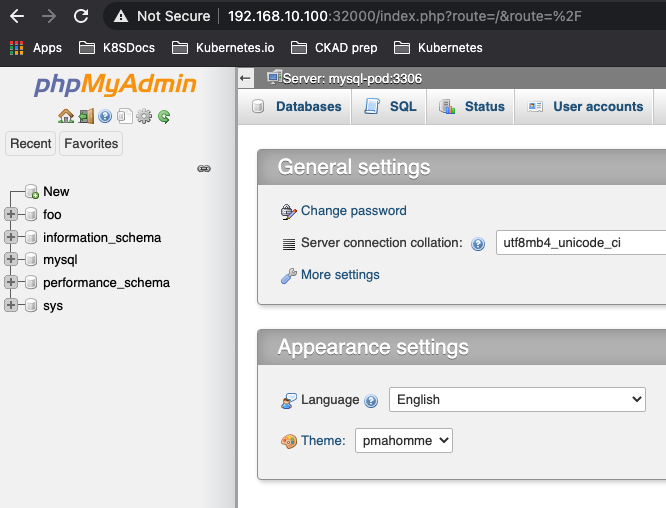

# CKAD Resources

Here I will document some of my actions for
the [CKAD](https://training.linuxfoundation.org/training/kubernetes-for-developers/)
certification preparation.

## Kubernetes Cluster

To exercise you can create an AWS cluster or Google Cloud one, but they may be
costly. You can also create your own cluster using virtualbox. I have created a
vagrant based project [here](http://ivo2u.nl/Z7) to easily create a cluster with
a master node and n worker nodes (default = 2).

## Courses

To prepare for the certification I followed two courses:

- [LFD259 at the linux foundation](https://training.linuxfoundation.org/training/kubernetes-for-developers/)
  This course has the certification included (with re test if needed)
- [Certified Kubernetes Administrator (CKA) with Practice Tests at Udemy](https://www.udemy.com/course/certified-kubernetes-administrator-with-practice-tests/)
  A very nice video based course with a kodekloud exercise place.

## Tips and tricks

- to save time you can use variables and aliases to make commands easier and
  faster to type:

```shell
#setting the namespace (just do this one again for another namespace if needed)
export NS=default
# You will do dry runs often and now you can just type $DR in stead of the whole thing
export DR='--dry-run=client -o yaml'
# use k to run the kubectl command in the exported namespace. Saves typing
alias k='kubectl -n $NS'
# if you know you are going to dry run...
alias kdr='k $DR'
# Now get code completion on both commands
complete -F __start_kubectl k kdr

# the above is the minimal setup. I prefer the following to

alias ka='kubectl get all -A'
alias kc='k create -f'
alias kd='k delete -f'
```

So...

<details><summary>Show</summary>
<p>

```shell
# if you forgot the kdr at the beginning just add the $DR
k run nginx --image=nginx --port 80 $DR >nginx.yml

# or if you didn't forget
kdr run nginx --image=nginx --port 80 >nginx.yml

# doing commands on another namespace
export NS=otherns
#use 'k' 'kdr' as you would normally
#don't forget to go back to the default ns again or use the fully qualified
#kubectl command if just for one command (default ns is default :-))
export NS=default
```

</p>
</details>

- be sure to learn basic vi and adjust the ~/.vimrc to accommodate what is
  needed for yaml manipulation

```shell
# edit the resource
vi ~/.vimrc
# remove everything in there
2000dd
# Add the following
set ts=2 sts=2 sw=2 et
# https://stackoverflow.com/questions/1878974/redefine-tab-as-4-spaces
# tabstop=2
# softtabstop=2
# shiftwidth=2
# expandtab (makes them into spaces)
```

- replace tabs with spaces in vi (important for copy paste actions)

```shell
# while in the vi editor in command mode
:%s/\t/  /g
#      ^^ are two spaces
#search for tabs and replace them with two spaces
```

## kubernetes.io bookmarks

For the certification you are allowed to have the kubernetes docs open in an
extra tab in your browser. It is very advisable to create shortcuts for every
topic.

- [here](k8s_favorites.html) are the ones I used.

## Other resources

- [Home k8s cluster](http://ivo2u.nl/Z7)
- [CKAD-exercises by dgkanatsios](https://github.com/dgkanatsios/CKAD-exercises)
- [CKAD-resources by lucassha](https://github.com/lucassha/CKAD-resources)
- [ckad-prep-nodes by twajr](https://github.com/twajr/ckad-prep-notes)
- [My CKAD exam experience by Atharva Chauthaiwale](https://www.linkedin.com/pulse/my-ckad-exam-experience-atharva-chauthaiwale/)
- [Udemy](https://www.udemy.com/course/certified-kubernetes-administrator-with-practice-tests/)
- [Certified Kubernetes Application Developer (CKAD) Learnings & Tips](https://medium.com/marcus-tee-anytime/certified-kubernetes-application-developer-ckad-learnings-tips-cc83c12ed555)
- [Practice Enough With These 150 Questions for the CKAD Exam](https://medium.com/bb-tutorials-and-thoughts/practice-enough-with-these-questions-for-the-ckad-exam-2f42d1228552)
- [How I successfully cleared Certified Kubernetes Application Developer CKAD...](https://qainsights.com/how-i-successfully-cleared-certified-kubernetes-application-developer-ckad-exam-in-5-weeks/)
- [LF - Important instructions](https://docs.linuxfoundation.org/tc-docs/certification/tips-cka-and-ckad)
- [cncf - curriculum](https://github.com/cncf/curriculum)
- [LF - Handbook](https://docs.linuxfoundation.org/tc-docs/certification/lf-candidate-handbook)

## Exercises

below some exercises not in the exam style but to give you practice in speed and
agility.

- give node worker1 the label `db=allow`
- Create a persistent volume with access mode `ReadWriteOnce` in the home folder
  of your user called `mysql-data` with 200Mi space
- In the `db` namespace do:
    - Create a volume claim for the same amount called `mysql-pvc` claiming
      persistent volume `mysql-data`
    - Configure a secret called `db-secret` containing MYSQL_ROOT_PASSWORD with
      value `s3cr3t`
    - Create a multi-container pod with a mysql and a phpmyadmin image
        - mysql:
            - env: called 'MYSQL_ROOT_PASSWORD' bound the `db-secret`
            - port: 3306
            - image: ivonet/mysql:5.7.29
            - mount the persistent volume claim called `mysql-pvc`
              on `/var/lib/mysql`
              and subPath `dbdata`
            - this pod must only be deployed on a node with the label `db=allow`  
        - phpmyadmin:
            - image: phpmyadmin
            - environment variables
                - PMA_HOST = \<the name of the mysql image>
                - PMA_PORT = \<the port of the mysql image>
                - MYSQL_ROOT_PASSWORD = \<the value of the secret
                  called `db-secret`>
                - port: 80
        - expose the phpmyadmin port to outside the cluster on port 32000
- Prove that it works by going to a browser tab an going to the 
  http://\<your_cluster_ip here>:32000 and log in with the credentials `root` 
  and password `s3cr3t`
  

<details><summary>Solution (cli based)</summary>
<p>

```shell
# first I performed these commands for speed
export DR='--dry-run=client -o yaml'
export NS=default
alias k='kubectl -n $NS'
alias kdr='k $DR'
alias kc='k create -f'
alias kd='k delete -f'
alias kg='k get po,svc,pv,pvc,secret,deploy,netpol'
alias ka='kubectl get all'
complete -F __start_kubectl k
complete -F __start_kubectl kdr

# label node worker1
k label nodes worker1 db=allow
# create the needed folder on the needed worker (worker1)
# I assume you are using my vagrant setup
ssh 192.168.10.111 
mkdir mysql-data
exit
```

- Create [PersistentVolume](https://kubernetes.io/docs/tasks/configure-pod-container/configure-persistent-volume-storage/#create-a-persistentvolume) (copy example)

```yaml
apiVersion: v1
kind: PersistentVolume
metadata:
  name: task-pv-volume
  labels:
    type: local
spec:
  storageClassName: manual
  capacity:
    storage: 10Gi
  accessModes:
    - ReadWriteOnce
  hostPath:
    path: "/mnt/data"
```

- change it to:

```yaml
apiVersion: v1
kind: PersistentVolume
metadata:
  name: mysql-pv
  labels:
    pv: mysql-pv
spec:
  storageClassName: manual
  capacity:
    storage: 200Mi
  accessModes:
    - ReadWriteMany
  hostPath:
    path: "/home/vagrant/mysql-data"
```

```shell
# a PersistentVolume is not bound to a contect
k create -f pv.yml
#or if aliased
kc pv.yml 
# create namespace db
k create ns db
# set ns to db
export NS=db
# Create a PVC
# https://kubernetes.io/docs/concepts/storage/persistent-volumes/#persistentvolumeclaims
```

- change the `pvc.yml` to:

```shell
apiVersion: v1
kind: PersistentVolumeClaim
metadata:
  name: mysql-pvc
  namespace: db
spec:
  accessModes:
    - ReadWriteMany
  volumeMode: Filesystem
  resources:
    requests:
      storage: 200Mi
  storageClassName: manual
  selector:
    matchLabels:
      pv: mysql-pv
```

- the `namespace` is not needed as you will be creating it within the namespace

```shell
kc pvc.yml
# check if bound
k get pv,pvc
NAME                        CAPACITY   ACCESS MODES   RECLAIM POLICY   STATUS   CLAIM          STORAGECLASS   REASON   AGE
persistentvolume/mysql-pv   200Mi      RWX            Retain           Bound    db/mysql-pvc   manual                  3m51s

NAME                              STATUS   VOLUME     CAPACITY   ACCESS MODES   STORAGECLASS   AGE
persistentvolumeclaim/mysql-pvc   Bound    mysql-pv   200Mi      RWX            manual         3m51s

# Create the secret
k create secret generic db-secret --from-literal=MYSQL_ROOT_PASSWORD=s3cr3t
# check
k get secret db-secret -o yaml
# or more specific
k get secret db-secret -o jsonpath='{.data}{"\n"}'
{"MYSQL_ROOT_PASSWORD":"czNjcjN0"} 

# create the base yaml for the multi pod
k run mysql --image=ivonet/mysql:5.7.29 --port 3306 --env=MYSQL_ROOT_PASSWORD=todo $DR>db.yml
# then env part needs to be changed to the secret
# https://kubernetes.io/docs/concepts/configuration/secret/#using-secrets-as-environment-variables (copy paste)
# the phpmyadmin needs to be added etc
# edit it mysql.yml
```

```yaml
apiVersion: v1
kind: Pod
metadata:
  labels:
    run: mysql
  name: mysql
  namespace: db
spec:
  affinity: # Add the node affinity db=allow
    nodeAffinity:
      requiredDuringSchedulingIgnoredDuringExecution:
        nodeSelectorTerms:
        - matchExpressions:
          - key: db
            operator: In
            values:
            - allow
  containers:
  - name: mysql-pod
    image: ivonet/mysql:5.7.29
    ports:
    - containerPort: 3306
    env:
    - name: MYSQL_ROOT_PASSWORD
      valueFrom: # Change the 'value: todo' to these lines (https://kubernetes.io/docs/concepts/configuration/secret/#using-secrets-as-environment-variables)
        secretKeyRef:
          name: db-secret
          key: MYSQL_ROOT_PASSWORD
    imagePullPolicy: IfNotPresent # I added this because I got blocked after pulling to much by docker
    volumeMounts:
    - name: db-data
      mountPath: /var/lib/mysql
      subPath: dbdata
    resources: {}
  - name: phpmyadmin-pod # add this whole part based on the former part with
    image: phpmyadmin
    ports:
    - containerPort: 80
    env:
    - name: MYSQL_ROOT_PASSWORD
      valueFrom:
        secretKeyRef:
          name: db-secret
          key: MYSQL_ROOT_PASSWORD
    - name: PMA_HOST
      value: mysql  # note that the host here must be the same as the .metadata.name
    - name: PMA_PORT
      value: "3306"
  restartPolicy: OnFailure
  volumes: # assign the pvc
  - name: db-data
    persistentVolumeClaim:
      claimName: mysql-pvc
```

```shell
# create it
kc db.yml
# check it
k describe po mysql
# and
k get po
NAME    READY   STATUS    RESTARTS   AGE
mysql   2/2     Running   0          5m36s
# expose it in a service
kdr expose pod mysql  --port 80 --type=NodePort >svc.yml
# change it to...
```

```yaml
apiVersion: v1
kind: Service
metadata:
  creationTimestamp: null
  labels:
    run: mysql
  name: mysql
spec:
  ports:
  - port: 80
    protocol: TCP
    nodePort: 32000
  selector:
    run: mysql
  type: NodePort
status:
  loadBalancer: {}
```

- `curl -q http://192.168.10.100:32000` should give a html result.
- try it in the browser and log in with the given creds...

</p>
</details>


